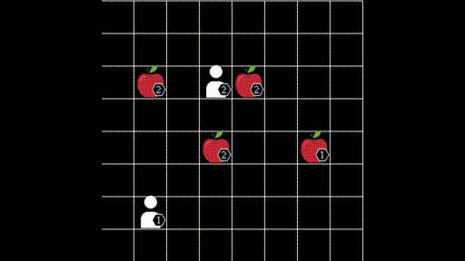

<p align="center">
 
 <p align="center">A multi-agent reinforcement learning environment</p>
</p>

<!-- TABLE OF CONTENTS -->
<h1> Table of Contents </h1>

- [About The Project](#about-the-project)
- [Getting Started](#getting-started)
  - [Installation](#installation)
- [Usage](#usage)
  - [Observation Space](#observation-space)
  - [Action space](#action-space)
  - [Rewards](#rewards)
- [Please Cite](#please-cite)
- [Contributing](#contributing)
- [Contact](#contact)


<!-- ABOUT THE PROJECT -->
# About The Project

This environment is a mixed cooperative-competitive game, which focuses on the coordination of the agents involved. Agents navigate a grid world and collect food by cooperating with other agents if needed.

<p align="center">
 
</p>

More specifically, agents are placed in the grid world, and each is assigned a level. Food is also randomly scattered, each having a level on its own. Agents can navigate the environment and can attempt to collect food placed next to them. The collection of food is successful only if the sum of the levels of the agents involved in loading is equal to or higher than the level of the food. Finally, agents are awarded points equal to the level of the food they helped collect, divided by their contribution (their level). The figures below show two states of the game, one that requires cooperation, and one more competitive.


While it may appear simple, this is a very challenging environment, requiring the cooperation of multiple agents while being competitive at the same time. In addition, the discount factor also necessitates speed for the maximisation of rewards. Each agent is only awarded points if it participates in the collection of food, and it has to balance between collecting low-levelled food on his own or cooperating in acquiring higher rewards. In situations with three or more agents, highly strategic decisions can be required, involving agents needing to choose with whom to cooperate. Another significant difficulty for RL algorithms is the sparsity of rewards, which causes slower learning.

This is a Python simulator for level based foraging. It is based on OpenAI's RL framework, with modifications for the multi-agent domain. The efficient implementation allows for thousands of simulation steps per second on a single thread, while the rendering capabilities allows humans to visualise agent actions. Our implementation can support different grid sizes or agent/food count. Also, game variants are implemented, such as cooperative mode (agents always need to cooperate) and shared reward (all agents always get the same reward), which is attractive as a credit assignment problem.


<!-- GETTING STARTED -->
# Getting Started

## Installation

Install using pip
```sh
pip install lbforaging
```
Or to ensure that you have the latest version:
```sh
git clone https://github.com/semitable/lb-foraging.git
cd lb-foraging
pip install -e .
```


<!-- USAGE EXAMPLES -->
# Usage

Create environments with the gym framework.
First import
```python
import lbforaging
```

Then create an environment:
```python
env = gym.make("Foraging-8x8-2p-1f-v2")
```

We offer a variety of environments using this template:
```
"Foraging-{GRID_SIZE}x{GRID_SIZE}-{PLAYER COUNT}p-{FOOD LOCATIONS}f{-coop IF COOPERATIVE MODE}-v0"
```

But you can register your own variation using (change parameters as needed):
```python
from gym.envs.registration register

register(
    id="Foraging-{0}x{0}-{1}p-{2}f{3}-v2".format(s, p, f, "-coop" if c else ""),
    entry_point="lbforaging.foraging:ForagingEnv",
    kwargs={
        "players": p,
        "max_player_level": 3,
        "field_size": (s, s),
        "max_food": f,
        "sight": s,
        "max_episode_steps": 50,
        "force_coop": c,
    },
)
```

Similarly to Gym, but adapted to multi-agent settings step() function is defined as
```python
nobs, nreward, ndone, ninfo = env.step(actions)
```

Where n-obs, n-rewards, n-done and n-info are LISTS of N items (where N is the number of agents). The i'th element of each list should be assigned to the i'th agent.


## Observation Space

## Action space

actions is a LIST of N INTEGERS (one of each agent) that should be executed in that step. The integers should correspond to the Enum below:

```python
class Action(Enum):
    NONE = 0
    NORTH = 1
    SOUTH = 2
    WEST = 3
    EAST = 4
    LOAD = 5
```
Valid actions can always be sampled like in a gym environment, using:
```python
env.action_space.sample() # [2, 3, 0, 1]
```
Also, ALL actions are valid. If an agent cannot move to a location or load, his action will be replaced with `NONE` automatically.

## Rewards

The rewards are calculated as follows. When one or more agents load a food, the food level is rewarded to the agents weighted with the level of each agent. Then the reward is normalised so that at the end, the sum of the rewards (if all foods have been picked-up) is one. 
If you prefer code:

```python
for a in adj_players: # the players that participated in loading the food
    a.reward = float(a.level * food) # higher-leveled agents contribute more and are rewarded more. 
    if self._normalize_reward:
        a.reward = a.reward / float(
            adj_player_level * self._food_spawned
        )  # normalize reward so that the final sum of rewards is one.
```

<!-- CITATION -->
# Please Cite
1. The paper that first uses this implementation of Level-based Foraging (LBF) and achieves state-of-the-art results:
```
@inproceedings{christianos2020shared,
  title={Shared Experience Actor-Critic for Multi-Agent Reinforcement Learning},
  author={Christianos, Filippos and Schäfer, Lukas and Albrecht, Stefano V},
  booktitle = {Advances in Neural Information Processing Systems (NeurIPS)},
  year={2020}
}
```
2. A comperative evaluation of cooperative MARL algorithms and includes an introduction to this environment:
```
@inproceedings{papoudakis2021benchmarking,
   title={Benchmarking Multi-Agent Deep Reinforcement Learning Algorithms in Cooperative Tasks},
   author={Georgios Papoudakis and Filippos Christianos and Lukas Schäfer and Stefano V. Albrecht},
   booktitle = {Proceedings of the Neural Information Processing Systems Track on Datasets and Benchmarks (NeurIPS)},
   year={2021},
   openreview = {https://openreview.net/forum?id=cIrPX-Sn5n},
}
```

<!-- CONTRIBUTING -->
# Contributing

1. Fork the Project
2. Create your Feature Branch (`git checkout -b feature/AmazingFeature`)
3. Commit your Changes (`git commit -m 'Add some AmazingFeature`)
4. Push to the Branch (`git push origin feature/AmazingFeature`)
5. Open a Pull Request


<!-- CONTACT -->
# Contact

Filippos Christianos - f.christianos@ed.ac.uk

Project Link: [https://github.com/semitable/lb-foraging](https://github.com/semitable/lb-foraging)

